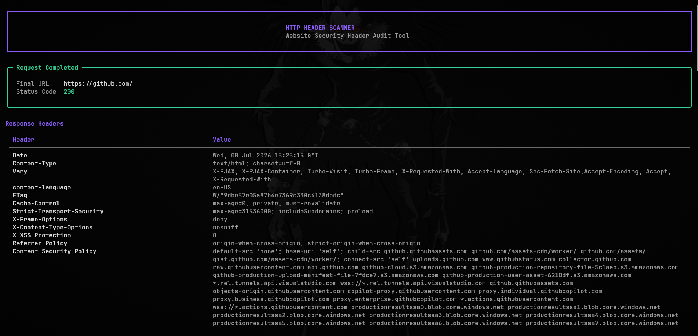
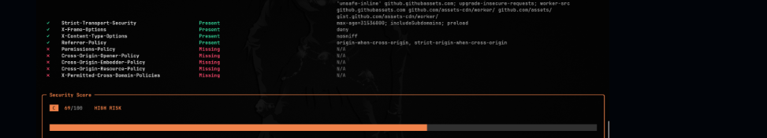
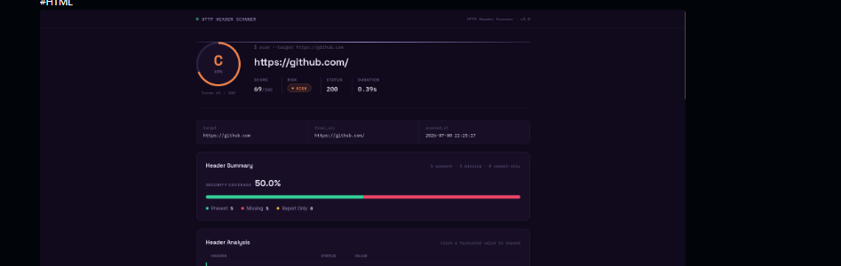

<h1 align="center">🛡️ HTTP Header Scanner</h1>

<div align="center">
  
  
  
  
  
</div>

<div align="center">
  
</div>

**HTTP Header Scanner** is a Python-based Command Line Interface (CLI) tool that scans a
website's HTTP response and assesses its security posture — checking modern security
headers, cookie security attributes, and producing a weighted 0–100 score with a
professional CLI, HTML, and JSON report.

This project was built as a cybersecurity learning project to practice Python while
producing a tool that works like real-world scanners such as Mozilla Observatory or
SecurityHeaders.com — understanding every line along the way rather than just shipping a
black box.

---

## 🚀 Features

<table>
  <thead>
    <tr>
      <th width="25%">Category</th>
      <th width="30%">Feature</th>
      <th width="45%">Technical Capabilities</th>
    </tr>
  </thead>
  <tbody>
    <tr>
      <td rowspan="4" align="center"><br><b>Core Engine</b></td>
      <td><code>HTTP Scanner</code></td>
      <td>Sends a live request to the target and captures the full response.</td>
    </tr>
    <tr>
      <td><code>Security Header Analysis</code></td>
      <td>Checks 10 modern security headers, classifying each as Present, Missing, or Report Only.</td>
    </tr>
    <tr>
      <td><code>Cookie Security Analysis</code> 🆕</td>
      <td>Parses every <code>Set-Cookie</code> header and validates Secure, HttpOnly, SameSite, and expiry.</td>
    </tr>
    <tr>
      <td><code>Weighted Security Score</code></td>
      <td>Sums per-header weights into a 0–100 score with a Low / Medium / High / Critical risk level.</td>
    </tr>
    <tr>
      <td rowspan="2" align="center"><br><b>Scanning Modes</b></td>
      <td>Single Target Scan</td>
      <td>Scan one URL directly from the command line or an interactive prompt.</td>
    </tr>
    <tr>
      <td>Batch Scan</td>
      <td>Scan a list of URLs from a text file with <code>--file</code>, one report set per target.</td>
    </tr>
    <tr>
      <td rowspan="3" align="center"><br><b>Data & Output</b></td>
      <td>Professional CLI Output</td>
      <td>Built with <a href="https://github.com/Textualize/rich">Rich</a>: tables, spinners, and color-coded panels.</td>
    </tr>
    <tr>
      <td>HTML Report</td>
      <td>A shareable, styled HTML report with score gauge, header table, cookie table, and prioritized fixes.</td>
    </tr>
    <tr>
      <td>JSON Report</td>
      <td>Machine-readable report with full header analysis, cookie analysis, and score breakdown.</td>
    </tr>
    <tr>
      <td rowspan="3" align="center"><br><b>Reliability</b> 🆕</td>
      <td>Configuration File</td>
      <td>Timeout, output folder, and logging level configurable via an auto-generated <code>config.ini</code> — no code edits needed.</td>
    </tr>
    <tr>
      <td>Logging</td>
      <td>Every scan is recorded to <code>logs/scanner.log</code>, including full tracebacks on failure.</td>
    </tr>
    <tr>
      <td>Graceful Error Handling</td>
      <td>Connection failures and unexpected exceptions show a clean message instead of crashing a batch run.</td>
    </tr>
    <tr>
      <td align="center"><br><b>Organization</b></td>
      <td>Per-Domain Reports</td>
      <td>Each target gets its own <code>reports/&lt;domain&gt;/</code> folder for JSON + HTML output.</td>
    </tr>
  </tbody>
</table>

---

## 📂 Project Structure

```text
http-header-scanner/
│
├── src/
│   ├── main.py             # CLI entry point / scan orchestration
│   ├── scanner.py          # HTTP requests
│   ├── analyzer.py         # Security header analysis
│   ├── cookie_analyzer.py  # Cookie security analysis
│   ├── scoring.py          # Security score & risk level calculation
│   ├── constants.py        # Header list, weights, risk/recommendation text
│   ├── display.py          # Rich CLI output
│   ├── exporter.py         # JSON report writer
│   ├── html_report.py      # HTML report generator
│   ├── config.py           # config.ini loader
│   ├── logger_config.py    # Logging setup
│   └── utils.py            # File / target-loading helpers
│
├── templates/
│   └── report.html         # HTML report template
│
├── static/
│   └── style.css           # HTML report styling
│
├── examples/
│   ├── single_target.txt
│   ├── multi_targets.txt
│   └── sample_report.json
│
├── docs/
│   ├── architecture.md     # Module responsibilities & data flow
│   ├── screenshots
│   
│
├── tests/
├── config.ini               # Auto-generated on first run
├── requirements.txt
├── pyproject.toml
└── README.md
```

See [`docs/architecture.md`](docs/architecture.md) for how data flows between these modules.

---

## 🔍 Security Headers Checked

| Header | Weight | What it protects against |
| :--- | :---: | :--- |
| `Content-Security-Policy` | 25 | Injection attacks (XSS) by restricting allowed script/style sources |
| `Strict-Transport-Security` | 20 | Protocol downgrade & cookie hijacking by forcing HTTPS |
| `Permissions-Policy` | 12 | Unauthorized use of browser features (camera, geolocation, etc.) |
| `X-Frame-Options` | 8 | Clickjacking via iframes |
| `X-Content-Type-Options` | 8 | MIME-type sniffing attacks |
| `Referrer-Policy` | 8 | Leaking sensitive URL data to third parties |
| `Cross-Origin-Opener-Policy` | 7 | Cross-window attacks (e.g. Spectre-style side channels) |
| `Cross-Origin-Resource-Policy` | 5 | Unauthorized cross-origin resource loading |
| `Cross-Origin-Embedder-Policy` | 5 | Loading cross-origin resources without explicit consent |
| `X-Permitted-Cross-Domain-Policies` | 2 | Legacy plugin (Flash/Acrobat) cross-domain abuse |

**Total: 100 points.** A perfect score means all 10 headers are present.

## 🍪 Cookie Attributes Checked

| Attribute | Why it matters |
| :--- | :--- |
| `Secure` | Cookie is only sent over HTTPS, never plain HTTP |
| `HttpOnly` | Blocks JavaScript from reading the cookie (mitigates XSS-based theft) |
| `SameSite` | Controls cross-site sending — core CSRF defense |
| `Expires` / `Max-Age` | Confirms the cookie has an explicit lifetime |

---

## 🚀 Installation

### Prerequisites
Python 3.9+ and `pip`.

### Quick Start

```bash
# 1. Clone the repository
git clone https://github.com/pagarkristian/http-header-scanner.git
```

```bash
# 2. Move into the project directory
cd http-header-scanner
```

```bash
# 3. Install dependencies
pip install -r requirements.txt
```

```bash
# 4. Run a scan
python -m src.main https://example.com
```

---

## 💡 Usage

🔹 **1. Single Target Scan**

```bash
python -m src.main https://example.com
```

```text
Security Header Analysis
══════════════════════════════════════════════════════════
✓  Content-Security-Policy       Present    default-src 'self'
✓  Strict-Transport-Security     Present    max-age=31536000
✗  X-Frame-Options               Missing    N/A
✓  X-Content-Type-Options        Present    nosniff
✗  Permissions-Policy            Missing    N/A
✗  Cross-Origin-Opener-Policy    Missing    N/A

Security Score: 73/100  ·  Risk Level: Medium

Cookie Security Analysis
══════════════════════════════════════════════════════════
✓  session      Secure   Yes   Yes   Strict   None

Report saved to: reports/example.com/report.json
HTML report saved to reports/example.com/report.html
```

🔹 **2. Batch Scan From File**

```bash
python -m src.main --file examples/multi_targets.txt
```

See [`examples/multi_targets.txt`](examples/multi_targets.txt) for the expected format
(one URL per line).

🔹 **3. Check Version**

```bash
python -m src.main --version
```

Each scan produces:
```text
reports/<domain>/report.json
reports/<domain>/report.html
```

A full sample report is available at
[`examples/sample_report.json`](examples/sample_report.json).

---

## ⚙️ Configuration

On first run, a `config.ini` file is created automatically:

```ini
[scanner]
timeout = 10

[output]
reports_dir = reports

[logging]
logs_dir = logs
log_level = INFO
```

Edit it to change the request timeout, output folder, or logging verbosity — no code
changes needed.

---

## 📝 Reports

#### JSON Report (`report.json`)
```json
{
  "scanner": "HTTP Header Scanner",
  "version": "3.8",
  "timestamp": "2026-07-08 03:48:24",
  "target": "https://example.com",
  "score": 73,
  "risk_level": "Medium",
  "summary": { "present": 3, "missing": 7, "report_only": 0 },
  "analysis": { "...": "..." },
  "cookies": [ "..." ],
  "cookie_summary": { "total": 1, "secure": 1, "needs_attention": 0 }
}
```

#### HTML Report (`report.html`)
A styled, shareable report: score gauge, header analysis table, cookie security table,
and a prioritized fix list ordered by score impact.

---

## 📋 Logging

| File | Location | What it does |
| :--- | :--- | :--- |
| 📋 **Activity Log** | `logs/scanner.log` | Records every scan attempt, including failures and full tracebacks. |

```text
2026-07-08 03:48:24 [INFO] Starting scan for https://example.com
2026-07-08 03:48:25 [INFO] Finished scan for https://example.com (score=73, risk=Medium, duration=1.0s)
```

---

## 🗺️ Version History

| Version | Status | Highlights |
| :---: | :---: | :--- |
| **v3.0 – v3.3** | ✅ Stable | HTTP scanning, header analysis, security score & risk level, Rich CLI, HTML/JSON reports, batch scanning, per-domain reports |
| **v3.4** | ✅ Stable | Cross-origin isolation headers (COOP, COEP, CORP, X-Permitted-Cross-Domain-Policies) |
| **v3.5** | ✅ Stable | Cookie Security Analysis (Secure, HttpOnly, SameSite, expiry) |
| **v3.6** | ✅ Stable | Configuration file, file-based logging, graceful error handling |
| **v3.7** | ✅ Stable | Full README, architecture docs, real example reports |
| **v3.8** | ✅ Stable | Release-candidate review — fixed a missing dependency and a report-styling path bug |

See [`CHANGELOG.md`](CHANGELOG.md) for the full, detailed history.

## 🔮 Roadmap

| Target | Status | Planned |
| :---: | :---: | :--- |
| **v4.0** | 🔵 Future | Concurrent batch scanning, CSP directive quality checks, historical scan comparison, CI-friendly `--fail-below` exit codes |

See [`docs/roadmap.md`](docs/roadmap.md) for the full list of ideas.

---

## 📸 Screenshots

| CLI Output | HTML Report |
| :---: | :---: |
|  |  |

See [`docs/screenshots/README.md`](docs/screenshots/README.md) if you want to regenerate
these from your own scan.

---

## 📄 License

This project is licensed under the **MIT License** — see [`LICENSE`](LICENSE). Free to
use, modify, and distribute for personal or educational purposes.

---

## 👨‍💻 Author

<div align="center">
  <h3>pagarkristian</h3>
  <p>Cybersecurity Student • Python Learner • Open Source Enthusiast</p>
</div>
